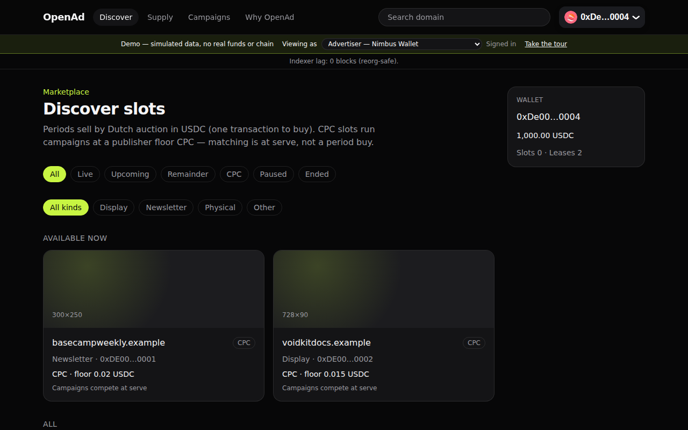
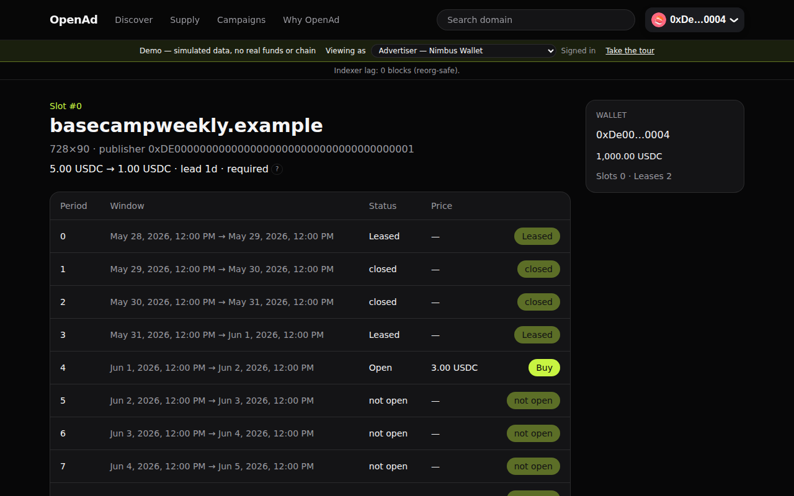
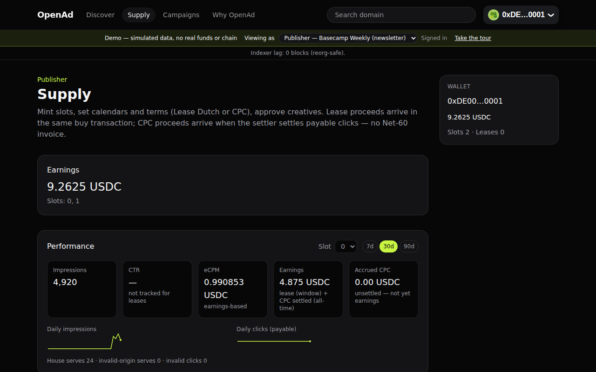
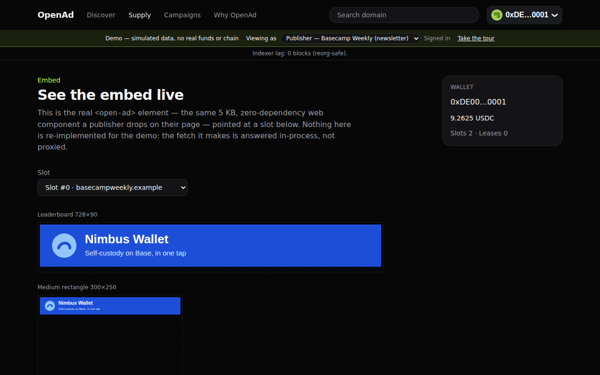

# OpenAd

A non-custodial advertising marketplace on Base: publishers mint ad **slots** as NFTs and sell
**periods** by Dutch auction or run them CPC; advertisers buy periods or fund campaigns in USDC,
in one transaction. See [`docs/GLOSSARY.md`](docs/GLOSSARY.md) for exact term definitions.

**Why publishers use it:** instant USDC payout — atomic in the buy transaction (LEASE) or at each
settler batch (CPC), not net-30; a low, transparent, on-chain-capped fee instead of a typical
ad-network cut; no approval gate to join.

**Why advertisers use it:** buy verifiable, publisher-approved placement in one transaction with
on-chain proof of spend; no third-party tracking in the serve path; a hard CPC budget cap when
running campaigns.

## Try it now

**[Live demo →](https://claude.ai/artifact/AzkEcWfmUT23GCo2qkWxE7)** — simulated data and a
simulated wallet, no real funds or chain. Click "Take the tour" from the banner for a guided walk
through both the advertiser and publisher sides.

**[Pitch deck →](https://claude.ai/artifact/Day12XXUFNi7CJdNpa2MUH)**

Both links are private until the owner shares them. If a link asks you to sign in or request
access, ask the OpenAd team for access.

## Screenshots

| Discover                                                             | The Dutch price falling                                                                   |
| -------------------------------------------------------------------- | ----------------------------------------------------------------------------------------- |
|  |  |

| Publisher performance                                                                                                    | The embed, live                                                                             |
| ------------------------------------------------------------------------------------------------------------------------ | ------------------------------------------------------------------------------------------- |
|  |  |

More at [`docs/business/assets/`](docs/business/assets/), generated reproducibly by
[`e2e/demo/capture-screenshots.mjs`](e2e/demo/capture-screenshots.mjs) (`npm run
capture:screenshots -w e2e`, after `npm run build:demo`).

## How it works

**LEASE mode.** The publisher sets `start_price`, `floor_price`, `lead_seconds` and `sale_end` on
a slot's **terms**. The price decays linearly from `start_price` to `floor_price` as the period's
**auction** window runs, then keeps falling toward zero if the period starts unsold. The first
**buy** is one transaction: it pays USDC, splits the platform **fee** to the treasury and the rest
to the publisher atomically, and writes a **lease** for that period. No bids, no escrow, no
settle step.

**CPC mode.** Advertisers open or top up a **campaign** (a max CPC, a creative, a USDC budget) in
the campaign vault. Eligible campaigns compete at serve time; a settler process batches
`settle_batch` calls that pay the treasury fee and the publisher out of escrowed, payable clicks.

**Invariants, in plain words:** no code in `api/` or `web/` can sign a user's transaction or move
their funds; `Marketplace` never holds USDC after a transaction; the campaign vault holds only
currently open campaign budgets; the **serve** endpoint never reads the chain and never proxies
advertiser media; money is integer USDC base units end to end. See [`AGENTS.md`](AGENTS.md) for
the full list.

## Quickstart (local)

Prerequisites: [uv](https://docs.astral.sh/uv/), Node ≥ 20, Docker Desktop (or a Docker daemon)
running.

**One-command Docker stack** (needs bash; Linux/macOS/WSL):

```text
npm run stack:docker
```

**Windows** (PowerShell shims bypass the execution-policy prompt):

```text
.\scripts\setup.cmd      # .env, docker, protocol deploy, alembic upgrade, npm install
.\scripts\dev-up.cmd     # starts docker if needed; titled windows: api, indexer, web  (add -Embed for the embed demo)
.\scripts\dev-down.cmd   # stops docker; next dev-up brings Anvil/Postgres back (Anvil chain is ephemeral)
```

**Linux/macOS/WSL** (bash twins, ADR-0007 amendment):

```text
./scripts/setup.sh       # same steps as setup.cmd; --skip-docker, --dry-run
./scripts/dev-up.sh      # starts docker if needed; background children, not titled windows (add --embed for the embed demo)
./scripts/dev-down.sh    # stops docker; --reset drops pgdata/31337.json/api/.cache
```

Setup deploys the protocol on Anvil (CreativeRegistry, AdSlot, Marketplace, MockUSDC) and applies
Alembic migrations. The manual equivalent of these scripts is in `docs/ARCHITECTURE.md` §7. After
the stack is up: API health at `http://localhost:8000/v1/health`, web at
`http://localhost:5173`.

## Run the demo locally

The hosted demo above is a static build with an in-memory simulated wallet — no local stack
needed to view it, but you can also build and serve it yourself:

```text
npm run build:demo          # writes web/dist-demo (hash router, relative base — any static host works)
npx serve web/dist-demo     # or any static file server
```

## Deploy

`docs/deploy-gcp.md` is the runbook for a GCP deployment (Cloud Run for `api`/`indexer`/`settler`,
Cloud SQL, GCS media cache, a static web/demo site). This repository ships the deploy config and a
CI docker build; an actual cloud deploy is a user-run step (a GCP project, secrets and a
committed Base Sepolia/mainnet deployments file are prerequisites — see
[`docs/business/launch-checklist.md`](docs/business/launch-checklist.md)).

## Documentation

Start at [`docs/README.md`](docs/README.md). AI agents and new contributors: read
[`AGENTS.md`](AGENTS.md) first.

| Document                                       | What it answers                                            |
| ---------------------------------------------- | ---------------------------------------------------------- |
| [`docs/GLOSSARY.md`](docs/GLOSSARY.md)         | What do the words mean?                                    |
| [`docs/PROTOCOL.md`](docs/PROTOCOL.md)         | What do the contracts do, exactly?                         |
| [`docs/ARCHITECTURE.md`](docs/ARCHITECTURE.md) | How do the packages fit together?                          |
| [`docs/CONVENTIONS.md`](docs/CONVENTIONS.md)   | How do we write and test code here?                        |
| [`docs/ROADMAP.md`](docs/ROADMAP.md)           | What is next, and what does "done" mean?                   |
| [`docs/adr/`](docs/adr/)                       | Why was it decided this way?                               |
| [`docs/business/`](docs/business/README.md)    | Market fit, GTM, pitch deck, demo script, launch checklist |

## Coming next

Publisher growth tooling — a copy-paste embed code panel, a shareable slot page, an "Advertise
here" badge, and audience/category listings — is in progress on a separate branch and not yet on
`main`.

## Repository layout

```text
contracts/   Vyper + Moccasin — AdSlot, Marketplace, CreativeRegistry, MockUSDC, CampaignVault
api/         Python/FastAPI — read API, serving edge, chain indexer, CPC settler
web/         Vite + React + MUI + wagmi — marketplace and dashboards (demo mode: ADR-0016)
embed/       <open-ad> web component (zero dependencies)
e2e/         Playwright — YAML scenarios and the demo-mode suite
sim/         Opt-in local Anvil persona daemon (ADR-0012)
docs/        Specifications, conventions, roadmap, ADRs, business docs
```

## Status

Testnet-ready; **not audited; no production deployment yet.** Phases 0–5 run end to end on local
Anvil (LEASE and CPC sale modes), and the demo above shows the full flow without needing a local
stack. Remaining: a Base Sepolia deployment, a security audit, and the first production deploy.
See [`docs/ROADMAP.md`](docs/ROADMAP.md).

## License

TBD.
