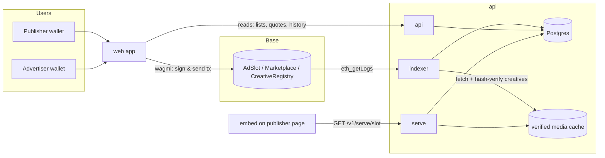

# OpenAd System Architecture

Status: **Specified**; scaffolds **Implemented** (see each package README and `ROADMAP.md`).
Protocol semantics live in [`PROTOCOL.md`](PROTOCOL.md); this document covers everything
around the contracts.

---

## 1. Package map

```text
OpenAd/
├── contracts/   Vyper + Moccasin.  AdSlot, Marketplace, CreativeRegistry, MockUSDC.   → deployments/<chainId>.json
├── api/         Python (FastAPI).  Three processes from one package `openad`:
│                  • api      – read API + auth + publisher/advertiser write helpers (off-chain data only)
│                  • serve    – GET /v1/serve/{slot_id} and /media  (may later move to a CDN worker)
│                  • indexer  – event → Postgres worker
├── web/         Vite + React + TypeScript + MUI + wagmi.  Marketplace, publisher & advertiser dashboards.
├── embed/       Vanilla TypeScript web component <open-ad>.  Zero dependencies.  Talks only to /v1/serve.
├── docs/        This folder.  Source of truth.
├── .cursor/     Cursor rules (per-package coding rules) — mirrors CONVENTIONS.md.
└── docker-compose.yml   anvil + postgres for local development.
```

Dependency direction (arrows = "depends on"):

```text
web ──► api (HTTP)          web ──► contracts (ABIs + addresses via deployments artifact, wallet writes)
embed ──► api (/v1/serve only)
api ──► contracts (ABIs + addresses via deployments artifact; RPC reads only in the indexer)
contracts ──► nothing
```

Nothing depends on `web` or `embed`. `contracts` depends on nothing in this repo.

---

## 2. Write path vs. read path (the central rule)



- **Writes go to the chain from the user's wallet.** The web app builds transactions with
  wagmi/viem and the user signs. The API never signs on behalf of users and never holds keys
  that can move funds or write leases.
- **Reads come from Postgres.** All lists, dashboards, and the serving edge read indexed state.
  The only live RPC reads allowed in the request path are (a) `Marketplace.quote` for a live price
  in the buy dialog (done in the browser via wagmi, not the API) and (b) health checks.
- **Postgres is a derived cache.** It must be fully rebuildable by resetting the indexer cursor
  and replaying events from the contract deployment block. Off-chain-only tables (house ads,
  domain verification, media verification, serve logs, sessions) are explicitly marked as such.

---

## 3. `api` package

### 3.1 Layout

```text
api/src/openad/
  main.py            FastAPI app factory `create_app()`; mounts routers; lifespan opens DB
  config.py          `Settings` (pydantic-settings). All env vars are prefixed OPENAD_.
  logging.py         structlog configuration (JSON in prod, console in dev)
  db/
    base.py          SQLAlchemy `Base`
    session.py       async engine + session factory + `get_session` dependency
  models/            SQLAlchemy 2.0 typed models, one file per aggregate
  schemas/           Pydantic response/request models (never expose ORM models directly)
  routers/           Thin HTTP layer: parse → call service → return schema. No business logic.
  services/          Business logic, pure functions over sessions. Unit-tested.
  chain/
    deployments.py   Load and validate contracts/deployments/<chainId>.json
    client.py        AsyncWeb3 factory (indexer only)
  indexer/
    runner.py        Poll loop, block-range batching, reorg safety, cursor persistence
    handlers.py      One handler per protocol event; idempotent upserts
    __main__.py      `python -m openad.indexer`
  serve/             Serving edge: creative resolution, media cache, origin checks
```

### 3.2 Database tables

Chain-derived (rebuildable):

| Table                 | Key                                         | Source events                                                                                 |
| --------------------- | ------------------------------------------- | --------------------------------------------------------------------------------------------- |
| `slots`               | `slot_id`                                   | `SlotMinted`, `Transfer` (owner), `CalendarSet` (version, period_seconds, first_period_start) |
| `terms`               | `slot_id`                                   | `TermsSet`, `PausedSet`                                                                       |
| `leases`              | `(slot_id, calendar_version, period_index)` | `LeaseSet` + `Purchased` (price, fee, approval_mode, tx hash)                                 |
| `creatives`           | `creative_id`                               | `CreativeRegistered`, `NftCreativeRegistered`, `CreativeRevoked`                              |
| `approvals`           | `(publisher, creative_id)`                  | `ApprovalRequested`, `ApprovalSet`                                                            |
| `allowed_advertisers` | `(publisher, advertiser)`                   | `AdvertiserAllowed`                                                                           |
| `protocol_config`     | singleton per chain                         | `MarketSet`, `FeeSet`, `TreasurySet`, `ModeratorSet`                                          |
| `indexer_cursor`      | `(chain_id, contract)`                      | last processed block number + hash; one row with `contract = "protocol"` covers all contracts |

Off-chain only:

| Table                     | Purpose                                                                                                                                       |
| ------------------------- | --------------------------------------------------------------------------------------------------------------------------------------------- |
| `house_ads`               | Publisher fallback creative per slot (`media_url`, `click_url`). Set via authenticated API.                                                   |
| `domain_verifications`    | `(slot_id, method, token, verified_at)`. See § 3.6.                                                                                           |
| `creative_verifications`  | `(creative_id, status, checked_at, cached_path, resolved_image_url, error)`. See § 3.5.                                                       |
| `serve_events`            | Append-only: `(slot_id, lease key or null, served_kind, origin_ok, at)`. Aggregated for delivery reports. No IPs, no user agents, no cookies. |
| `auth_nonces`, `sessions` | SIWE login state.                                                                                                                             |

Migrations: Alembic, one revision per PR that touches models. Postgres in dev/prod, SQLite in
unit tests.

### 3.3 HTTP API (`/v1`)

Public reads:

- `GET /v1/health` — liveness; includes indexer lag in blocks.
- `GET /v1/slots?domain=&kind=&verified=` — list slots with terms, next open periods, indicative prices.
- `GET /v1/slots/{slot_id}` — slot detail; also serves as ERC-721 `tokenURI` metadata JSON when `Accept: application/json` (this is what `AdSlot.base_uri` points at).
- `GET /v1/slots/{slot_id}/periods?from=&to=` — period calendar with lease status and quote inputs.
- `GET /v1/creatives/{creative_id}` — creative + verification status.
- `GET /v1/publishers/{address}/…`, `GET /v1/advertisers/{address}/…` — dashboards' read models.

Serving (public, cacheable):

- `GET /v1/serve/{slot_id}` — JSON described in § 3.4.
- `GET /v1/serve/{slot_id}/media` — the verified media bytes for the current lease (or house ad), with `Cache-Control` and `ETag`. Advertisers never see visitor traffic.

Authenticated (SIWE session; wallet must match the acting address):

- `POST /v1/auth/nonce`, `POST /v1/auth/verify`, `POST /v1/auth/logout`.
- `PUT /v1/slots/{slot_id}/house-ad` — slot owner only.
- `POST /v1/slots/{slot_id}/domain-verification` — start/refresh verification.
- `POST /v1/creatives/{creative_id}/verify` — request (re)verification of media.

No endpoint ever accepts a private key or signs a chain transaction.

### 3.4 Serve contract (shared with `embed`)

The embed and the API must agree on this exactly. TypeScript type: `embed/src/types.ts`.
Pydantic model: `api/src/openad/schemas/serve.py`.

```json
{
  "slotId": "42",
  "status": "lease" | "house" | "empty" | "unknown",
  "creative": {
    "kind": "image",
    "mediaUrl": "https://api.example/v1/serve/42/media?v=0xabc…",
    "clickUrl": "https://advertiser.example/landing",
    "width": 300,
    "height": 250,
    "alt": "Sponsored"
  } | null,
  "lease": { "advertiser": "0x…", "expiresAt": "2026-09-15T00:00:00Z" } | null,
  "ttl": 30
}
```

Rules: `ttl` seconds is how long the embed may reuse the response; the API sets
`Cache-Control: public, max-age=<ttl>`. `mediaUrl` is always same-origin to the API (verified
cache), never the advertiser's URL. `status = "unknown"` → HTTP 404.

Origin enforcement: when `OPENAD_SERVE_ENFORCE_ORIGIN=true`, requests whose `Origin`/`Referer`
host does not match the slot's `domain` (or a subdomain of it) are answered with the house ad
and logged with `origin_ok=false`. Disabled by default in local development.

### 3.5 Creative verification and media cache

Triggered by the indexer on `CreativeRegistered` and re-run on a schedule
(`OPENAD_VERIFY_INTERVAL_SECONDS`, default 6h) and on demand.

`MEDIA`:

1. Fetch `uri` (`https://` directly; `ipfs://` through `OPENAD_IPFS_GATEWAY`). Enforce
   `OPENAD_MAX_MEDIA_BYTES` (default 2 MiB) and a 10 s timeout.
2. `keccak256(bytes) == content_hash`, else `failed:hash_mismatch`.
3. Sniff MIME; must equal `mime` and be in the allowlist (`image/png`, `image/jpeg`,
   `image/webp`, `image/gif`). Decode and check `width × height` equals the registered
   dimensions, else `failed:dimensions`.
4. `click_url` must be `https://` and not on the phishing blocklist (`OPENAD_SAFE_BROWSING_KEY`,
   optional in dev).
5. Store bytes at `cached_path` (local disk in dev, object storage in prod). Mark `verified`.

`NFT_REF`:

1. Resolve `tokenURI`/`uri(id)` via the RPC configured for `nft_chain_id`
   (`OPENAD_RPC_URL_<chainId>`); apply ERC-1155 `{id}` substitution; fetch metadata JSON.
2. Fetch `image` (v1: raster images only; `animation_url` ignored). Cache as above.
3. Verify `ownerOf(token) == advertiser` (ERC-721) or `balanceOf(advertiser, id) > 0`
   (ERC-1155). Re-checked on every scheduled run; failure → `failed:not_owner` → not served.

A creative that fails verification is never served, regardless of on-chain approval. The
publisher and advertiser see the failure reason in their dashboards.

### 3.6 Domain verification

Off-chain badge, not a protocol rule. The slot owner requests a token via the API and proves
control by either a DNS TXT record `openad-verification=<token>` at `_openad.<domain>` or a
`<meta name="openad-site-verification" content="<token>">` tag on `https://<domain>/`. Re-checked
weekly. The marketplace UI shows unverified slots with a warning.

### 3.7 Indexer

- One multi-address `eth_getLogs` per block range covering all three contracts, starting at the
  lowest `startBlock` in the deployments artifact. Events are applied in global
  `(blockNumber, logIndex)` order, which guarantees cross-contract ordering inside a
  transaction (`AdSlot.LeaseSet` precedes `Marketplace.Purchased`) and during replays.
- Processes only up to the `safe` block tag (falls back to `latest - OPENAD_INDEXER_CONFIRMATIONS`
  when the node does not support `safe`, e.g. Anvil).
- Batches `OPENAD_INDEXER_BATCH_BLOCKS` (default 2000) per query.
- Stores a single `(block_number, block_hash)` cursor (`indexer_cursor.contract = "protocol"`);
  on hash mismatch rewinds `OPENAD_INDEXER_REORG_DEPTH` blocks and re-processes. Handlers are
  therefore idempotent upserts keyed by on-chain identifiers.
- One handler per event in `handlers.py`; the list of events must match `PROTOCOL.md` § 6.
- After `LeaseSet`, `ApprovalSet`, `CreativeRevoked`, `AdvertiserAllowed`, and verification
  changes, the indexer invalidates the serve cache for affected slots.

### 3.8 Configuration

All settings are environment variables with the `OPENAD_` prefix, loaded by `openad.config.Settings`.
See `.env.example` at the repo root for the full list with defaults. Never read `os.environ`
directly outside `config.py`.

---

## 4. `contracts` package

- Moccasin project; Vyper `~=0.4.0`; snekmate for ERC-721/ERC-20/ownable.
- `src/interfaces/*.vyi` are the canonical signatures and are imported by implementations.
- `src/mocks/MockUSDC.vy` — 6-decimal ERC-20 with EIP-2612 permit for Anvil/tests.
- `script/deploy.py` deploys in the order given in `PROTOCOL.md` § 10 and writes the deployments artifact.
- Tests: unit/property tests in titanoboa (`mox test`), integration against Anvil via
  `--network anvil`, fork tests against Base for real USDC `permit` behaviour.

### 4.1 Deployments artifact

`contracts/deployments/<chainId>.json` is the **only** hand-off from contracts to the other
packages. Committed for public networks; `31337.json` is regenerated locally and git-ignored.

```json
{
  "chainId": 84532,
  "network": "base-sepolia",
  "deployedAt": "2026-09-09T00:00:00Z",
  "deployer": "0x…",
  "contracts": {
    "AdSlot":           { "address": "0x…", "startBlock": 123, "abi": [ … ] },
    "Marketplace":      { "address": "0x…", "startBlock": 124, "abi": [ … ] },
    "CreativeRegistry": { "address": "0x…", "startBlock": 122, "abi": [ … ] },
    "USDC":             { "address": "0x…", "startBlock": 0,   "abi": [ … ] }
  }
}
```

Consumers: `api` (`OPENAD_DEPLOYMENTS_DIR`, picks `<OPENAD_CHAIN_ID>.json`), `web`
(`npm run sync:deployments` copies into `web/src/generated/`). `embed` never touches it.

---

## 5. `web` package

- Vite SPA (no SSR). React 19, TypeScript strict, MUI for UI, `react-router` for routing,
  TanStack Query for server state, wagmi + viem for wallets and contract writes.
- Chains: Anvil (`foundry`, 31337), Base Sepolia, Base. Selected by `VITE_CHAIN_ID`.
- Connectors: injected (MetaMask etc.) and Coinbase Wallet (smart wallet preferred on Base).
  RainbowKit/AppKit may be added later (ADR).
- Layout:

```text
web/src/
  main.tsx            providers: Theme, QueryClient, Wagmi, Router
  app/                routes + layout shell
  features/
    marketplace/      public browse + buy dialog (quote via wagmi, buy via wagmi)
    publisher/        mint slot, set calendar/terms, approvals, house ad, earnings
    advertiser/       creatives, approvals requested, leases, delivery report
    auth/             SIWE sign-in against the API
  components/         shared presentational components
  lib/
    api.ts            typed fetch client for /v1 (generated client planned; see ROADMAP)
    wagmi.ts          chains + connectors + transports
    deployments.ts    addresses/ABIs from src/generated/deployments/<chainId>.json
    format.ts         USDC / time formatting helpers (base units in, strings out)
  theme/              single MUI theme
  generated/          git-ignored; produced by scripts/sync-deployments.mjs
```

- Reads: API only. Writes: wagmi `useWriteContract` with ABIs from the deployments artifact.
- All money is handled as `bigint` base units until the formatting layer.

---

## 6. `embed` package

- One custom element: `<open-ad slot-id="42" api="https://api.example" width="300" height="250" house-src="…" house-href="…">`
  (`slot-id`, not `slot`: `slot` is a reserved global attribute for shadow-DOM slotting).
- Zero runtime dependencies; ES2020; shadow DOM; renders
  `<a target="_blank" rel="noopener noreferrer nofollow sponsored"></a>`.
- Fetches `GET {api}/v1/serve/{slot-id}` when the element becomes visible, re-fetches after
  `ttl` seconds while visible (`IntersectionObserver`), falls back to house attributes on error,
  rejects non-`http(s)` click URLs.
- Sends nothing but the slot id. No cookies, no storage, no fingerprinting, no third-party
  requests (media is same-origin to the API).
- Size budget: **≤ 5 KB gzipped** for `dist/open-ad.js`, enforced by `scripts/check-size.mjs`.
- Dispatches `openad:render` (`{ slotId, status }`) and `openad:error` events for publishers.

---

## 7. Environments

|             | Anvil (local)                                         | Base Sepolia (staging)   | Base (production)       |
| ----------- | ----------------------------------------------------- | ------------------------ | ----------------------- |
| Chain       | `docker compose up anvil`, chain id 31337, 2 s blocks | public RPC               | public RPC              |
| USDC        | `MockUSDC`                                            | Circle testnet USDC      | native USDC             |
| DB          | `docker compose up postgres`                          | managed Postgres         | managed Postgres        |
| Media cache | local `./.cache/media`                                | object storage           | object storage + CDN    |
| Deployments | `contracts/deployments/31337.json` (ignored)          | `84532.json` (committed) | `8453.json` (committed) |

Local loop (canonical on Windows: `.\scripts\setup.cmd`, `.\scripts\dev-up.cmd`, `.\scripts\dev-down.cmd`;
`npm run stack:*` is the same if PowerShell can load `npm.ps1`):

```text
.\scripts\setup.cmd                      # idempotent; MockUSDC-only until ROADMAP 1.1-1.4
.\scripts\dev-up.cmd                     # starts docker if needed; titled windows: api, indexer, web (-Embed optional)
.\scripts\dev-down.cmd                   # stops docker; next up restarts Anvil/Postgres (Anvil chain is ephemeral)
```

What the scripts run (manual equivalent):

```text
docker compose up -d                     # anvil :8545, postgres :15432 (container 5432)
cd contracts && uv run mox run deploy --network anvil     # writes deployments/31337.json (MockUSDC only today)
cd api && uv run python -m openad.db.bootstrap            # after ROADMAP 2.2: uv run alembic upgrade head
cd api && uv run uvicorn openad.main:app --reload
cd api && uv run python -m openad.indexer
npm run dev:web                          # http://localhost:5173
npm run dev:embed                        # demo page using a local slot
```

---

## 8. Security and privacy posture

- No custodial keys. The deploy key exists only in the contracts environment (Moccasin encrypted wallet).
- Serving never reads the chain and never proxies to advertiser URLs at request time.
- Visitors are never exposed to advertisers: media is served from the verified cache; no third-party requests from the embed.
- No cookies, IPs, or user agents are stored by the serving edge.
- Creatives are raster images only in v1; no advertiser HTML/JS ever executes on a publisher page.
- Publisher takedown (`set_approval(false)` / `revoke_approval`) and moderator takedown propagate within one indexer cycle plus `ttl`.
