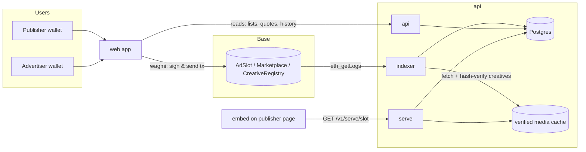

# OpenAd System Architecture

Status: **Specified**; scaffolds **Implemented** (see each package README and `ROADMAP.md`).
Protocol semantics live in [`PROTOCOL.md`](PROTOCOL.md); this document covers everything
around the contracts.

---

## 1. Package map

```text
OpenAd/
├── contracts/   Vyper + Moccasin.  AdSlot, Marketplace, CreativeRegistry, MockUSDC,
│                CampaignVault (ADR-0014).   → deployments/<chainId>.json
├── api/         Python (FastAPI).  Four processes from one package `openad`:
│                  • api      – read API + auth + publisher/advertiser write helpers (off-chain data only)
│                  • serve    – GET /v1/serve/{slot_id} and /media  (may later move to a CDN worker)
│                  • indexer  – event → Postgres worker
│                  • settler  – CPC `settle_batch` signer (ADR-0014). Not the HTTP API.
├── web/         Vite + React + TypeScript + Tailwind + RainbowKit + wagmi. Discover, Supply, Campaigns.
├── embed/       Vanilla TypeScript web component <open-ad>.  Zero dependencies.  Talks only to /v1/serve.
├── e2e/         Playwright + YAML scenarios (ADR-0010). Mock EIP-1193 wallets.
├── sim/         Opt-in Anvil persona daemon (ADR-0012). Not started by dev-up.
├── workers/     Source-only Cloudflare Worker for /v1/serve (not deployed).
├── docs/        This folder.  Source of truth (including docs/qa critique loop).
├── .cursor/     Cursor rules, MCP servers, and headed SME/UX skills — mirrors CONVENTIONS.md.
└── docker-compose.yml (+ docker-compose.stack.yml for local API/indexer containers; not GCP).
```

Dependency direction (arrows = "depends on"):

```text
web ──► api (HTTP)          web ──► contracts (ABIs + addresses via deployments artifact, wallet writes)
embed ──► api (/v1/serve only)
sim ──► contracts (Anvil wallet writes, 31337 only)    sim ──► api (HTTP reads + SIWE house ads)
api ──► contracts (ABIs + addresses via deployments artifact; RPC reads only in the indexer)
contracts ──► nothing
```

Nothing depends on `web`, `embed`, or `sim`. `contracts` depends on nothing in this repo.

---

## 2. Write path vs. read path (the central rule)



- **Writes go to the chain from the user's wallet.** The web app builds transactions with
  wagmi/viem and the user signs. The API never signs on behalf of users and never holds keys
  that can move funds or write leases.
- **Reads come from Postgres.** All lists, dashboards, and the serving edge read indexed state.
  The only live RPC reads allowed in the request path are (a) `Marketplace.quote` for a live price
  in the buy dialog (done in the browser via wagmi, not the API) and (b) health checks.
- **Postgres is a derived cache.** It must be fully rebuildable by resetting the indexer cursor
  and replaying events from the contract deployment block. Off-chain-only tables (house ads,
  domain verification, media verification, serve logs, sessions) are explicitly marked as such.

---

## 3. `api` package

### 3.1 Layout

```text
api/src/openad/
  main.py            FastAPI app factory `create_app()`; mounts routers; lifespan opens DB
  config.py          `Settings` (pydantic-settings). All env vars are prefixed OPENAD_.
  logging.py         structlog configuration (JSON in prod, console in dev)
  siwe.py            Strict EIP-4361 parser + origin binding for sign-in (ADR-0009 amendment)
  ratelimit.py       Opt-in per-process rate limit for POST /v1/auth/nonce and /verify
  db/
    base.py          SQLAlchemy `Base`
    session.py       async engine + session factory + `get_session` dependency
  models/            SQLAlchemy 2.0 typed models, one file per aggregate
  schemas/           Pydantic response/request models (never expose ORM models directly)
  routers/           Thin HTTP layer: parse → call service → return schema. No business logic.
  services/          Business logic, pure functions over sessions. Unit-tested.
  chain/
    deployments.py   Load and validate contracts/deployments/<chainId>.json
    client.py        AsyncWeb3 factory (indexer only)
  indexer/
    runner.py        Poll loop, block-range batching, reorg safety, cursor persistence
    handlers.py      One handler per protocol event; idempotent upserts
    __main__.py      `python -m openad.indexer`
  serve/             Serving edge: creative resolution, media cache, origin checks
```

### 3.2 Database tables

Chain-derived (rebuildable):

| Table                 | Key                                         | Source events                                                                                 |
| --------------------- | ------------------------------------------- | --------------------------------------------------------------------------------------------- |
| `slots`               | `slot_id`                                   | `SlotMinted`, `Transfer` (owner), `CalendarSet` (version, period_seconds, first_period_start) |
| `terms`               | `slot_id`                                   | `TermsSet` (`sale_mode`, `floor_cpc`, prices), `PausedSet`                                    |
| `leases`              | `(slot_id, calendar_version, period_index)` | `LeaseSet` + `Purchased` (price, fee, approval_mode, tx hash)                                 |
| `creatives`           | `creative_id`                               | `CreativeRegistered`, `NftCreativeRegistered`, `CreativeRevoked`                              |
| `approvals`           | `(publisher, creative_id)`                  | `ApprovalRequested`, `ApprovalSet`                                                            |
| `allowed_advertisers` | `(publisher, advertiser)`                   | `AdvertiserAllowed`                                                                           |
| `protocol_config`     | singleton per chain                         | `MarketSet`, `FeeSet`, `TreasurySet`, `ModeratorSet`, `CampaignVaultSet`, vault owner events  |
| `campaigns`           | `campaign_id`                               | `CampaignOpened` + top-up / max CPC / pause / close / finalize                                |
| `campaign_settlements`| `batch_id`                                  | `Settled`                                                                                     |
| `indexer_cursor`      | `(chain_id, contract)`                      | last processed block number + hash; one row with `contract = "protocol"` covers all contracts |

Off-chain only:

| Table                     | Purpose                                                                                                                                       |
| ------------------------- | --------------------------------------------------------------------------------------------------------------------------------------------- |
| `house_ads`               | Publisher fallback creative per slot (`media_url`, `click_url`). Set via authenticated API.                                                   |
| `slot_listings`           | Publisher-provided audience description (`summary`, `audience`, `categories`) per slot (ROADMAP 6.3). Self-described, not verified. Set via authenticated API (owner-only). Off-chain and not rebuildable from chain — back it up. |
| `domain_verifications`    | `(slot_id, method, token, verified_at)`. See § 3.6.                                                                                           |
| `creative_verifications`  | `(creative_id, status, checked_at, cached_path, resolved_image_url, error)`. See § 3.5.                                                       |
| `serve_events`            | Append-only: `(slot_id, lease key or campaign_id or null, served_kind, origin_ok, at, gsp_cpc?)`. No IPs, no user agents, no cookies. |
| `click_events`            | Token hash, campaign_id, payable flag, IVT reason, GSP, optional settle batch. No raw IPs. |
| `auth_nonces`, `sessions` | SIWE login state. Used or expired nonces and expired sessions are pruned from `POST /v1/auth/nonce`, at most once a minute per process (§ 3.3). |

Migrations: Alembic, one revision per PR that touches models. Postgres in dev/prod, SQLite in
unit tests.

### 3.3 HTTP API (`/v1`)

Public reads:

- `GET /v1/health` — liveness; includes indexer lag in blocks.
- `GET /v1/slots?domain=&kind=&verified=` — list slots with terms, next open periods, indicative prices.
- `GET /v1/slots/{slot_id}` — slot detail; also serves as ERC-721 `tokenURI` metadata JSON when `Accept: application/json` (this is what `AdSlot.base_uri` points at).
- `GET /v1/slots/{slot_id}/periods?from=&to=` — period calendar with lease status and quote
  inputs. Capped at 60 periods per request (`to − from + 1 ≤ 60`); a wider window gets a
  house-style 422 `invalid_window` (threat model T19). `from`/`to` are also bounded to a valid
  uint256, so an out-of-range index gets FastAPI's normal 422 instead of a 500. Leases in the
  window are read with one query, not one per period index.
- `GET /v1/creatives/{creative_id}` — creative + verification status.
- `GET /v1/publishers/{address}/…`, `GET /v1/advertisers/{address}/…` — dashboards' read models.
- `GET /v1/analytics/slots/{slot_id}`, `GET /v1/analytics/advertisers/{address}` — CTR/eCPM/
  spend/earnings read model; see § 3.10.

Serving (public, cacheable):

- `GET /v1/serve/{slot_id}` — JSON described in § 3.4.
- `GET /v1/serve/{slot_id}/media` — the verified media bytes for the current lease, CPC winner, or house ad, with `Cache-Control` and `ETag`. Advertisers never see visitor traffic.
- `GET /v1/c/{token}` — one-time click token → 302 to the creative `click_url` if valid; 404 otherwise. Not a media proxy.

Authenticated (SIWE session; wallet must match the acting address):

- `POST /v1/auth/nonce`, `POST /v1/auth/verify`, `POST /v1/auth/logout`.
- `PUT /v1/slots/{slot_id}/house-ad` — slot owner only.
- `POST /v1/slots/{slot_id}/domain-verification` — start/refresh verification.
- `POST /v1/creatives/{creative_id}/verify` — request (re)verification of media.

No endpoint ever accepts a private key or signs a chain transaction.

Sign-in rules (ADR-0009 and its 2026-09-25 amendment; threat model T15, T16):

- **Strict EIP-4361 message** (`openad/siwe.py`). The parser accepts only EIP-4361's layout
  (`address LF LF [statement LF] LF "URI: "…`) with an EIP-55 address, and the field order.
  Unknown, duplicate or reordered lines, CR characters and trailing text get 401 "malformed
  SIWE message". The web app and the sim build the message with viem's `createSiweMessage`.
  The body's `message` is capped at 4096 characters; a longer one, like any invalid body on
  `/v1/auth/*`, gets a house-style 422 `{"error":"invalid_request",…}`.
- **Origin binding.** The message's `domain` must be the authority (`host:port`) of an
  allowed web origin, and its `URI` must have that same origin. Otherwise the API answers 401
  "domain not allowed".
  - Allowed origins: `OPENAD_SIWE_ALLOWED_ORIGINS` (comma-separated), falling back to
    `OPENAD_CORS_ORIGINS`.
  - The web app signs with `window.location.host` and `window.location.origin`. The sim
    signs as `OPENAD_SIM_WEB_ORIGIN`. Neither ever signs as the API's own URL.
- **Checks in order:** parse, bind, chain id (`OPENAD_CHAIN_ID`), time, signature.
  - `Issued At` must be within `[now − 10 min − 5 min, now + 5 min]` (5 minutes of skew).
  - `Expiration Time` and `Not Before` are honoured, with 5 minutes of skew for `Not Before`.
- **Nonce.** Only after all the checks pass is the nonce consumed, by one conditional
  `UPDATE` that must hit exactly one row. The session row is created in the same
  transaction. A rejected message leaves its nonce unused.
- **Pruning.** `POST /v1/auth/nonce` deletes used or expired nonces and expired sessions, at
  most once every 60 s per process. The prune is best-effort and never blocks issuance. The
  expiry DELETEs use the `created_at` and `expires_at` indexes (migration `0005`); used
  nonces go in a separate DELETE that runs after them.
- **Rate limit (opt-in, per instance).** `OPENAD_AUTH_RATE_LIMIT_PER_MINUTE` (default `0`,
  off) puts a token bucket per client on `POST /v1/auth/nonce` and `/verify` only. Over the
  limit, the API answers 429 `{"error":"rate_limited",…}` with `Retry-After`. At most
  10 000 client keys are kept, in an LRU.
  - The client key is the TCP peer when `OPENAD_TRUSTED_PROXY_HOPS=0`. Otherwise it is the
    N-th `X-Forwarded-For` entry from the right, so spoofed left-hand entries do not matter.
  - For a global limit, use Cloud Armor on a load balancer (`docs/deploy-gcp.md`).

### 3.4 Serve contract (shared with `embed`)

The embed and the API must agree on this exactly. TypeScript type: `embed/src/types.ts`.
Pydantic model: `api/src/openad/schemas/serve.py`.

```json
{
  "slotId": "42",
  "status": "lease" | "campaign" | "house" | "empty" | "unknown",
  "creative": {
    "kind": "image",
    "mediaUrl": "https://api.example/v1/serve/42/media?v=0xabc…",
    "clickUrl": "https://advertiser.example/landing",
    "width": 300,
    "height": 250,
    "alt": "Sponsored"
  } | null,
  "lease": { "advertiser": "0x…", "expiresAt": "2026-09-15T00:00:00Z" } | null,
  "campaign": { "advertiser": "0x…", "campaignId": "3" } | null,
  "ttl": 30
}
```

Rules: `ttl` seconds is how long the embed may reuse the response; the API sets
`Cache-Control: public, max-age=<ttl>`. `mediaUrl` is always same-origin to the API (verified
cache), never the advertiser's URL. `status = "unknown"` → HTTP 404. `status = "campaign"`:
`campaign` is set, `lease` is null, `clickUrl` is `{api}/v1/c/{token}`
not the advertiser landing URL. House ads keep the publisher `clickUrl` and are never payable.

Origin enforcement: when `OPENAD_SERVE_ENFORCE_ORIGIN=true`, requests whose `Origin`/`Referer`
host does not match the slot's `domain` (or a subdomain of it) are answered with the house ad
and logged with `origin_ok=false`. Disabled by default in local development.

**Serve CORS.** `<open-ad>` runs on a publisher's own domain, so `GET /v1/serve/{slot_id}` and
`/v1/serve/{slot_id}/media` must be readable cross-origin. `ServeCorsMiddleware`
(`api/src/openad/main.py`) answers every origin on those two routes with
`Access-Control-Allow-Origin: *`, no `Access-Control-Allow-Credentials`, and handles the
`OPTIONS` preflight itself. It is a small ASGI middleware added after (so it wraps outside)
the app's credentialed `CORSMiddleware`, which stays unchanged — and unaware of this — for
every other route, still gated by `OPENAD_CORS_ORIGINS`. CORS (who may read the response) and
origin enforcement above (paid vs house) are independent: the middleware forwards the real
`Origin`/`Referer` headers to the handler unchanged and only rewrites the response's CORS
headers, discarding any the inner `CORSMiddleware` added for the same request (it otherwise sets
`Access-Control-Allow-Credentials: true` on a serve response whenever an `Origin` header is
present, even for an origin outside its own allowlist).

### 3.5 Creative verification and media cache

Triggered by the indexer on `CreativeRegistered` and re-run on a schedule
(`OPENAD_VERIFY_INTERVAL_SECONDS`, default 6h) and on demand.

`MEDIA`:

1. Fetch `uri` (`https://` directly outside dev/test, `http://` also allowed in dev/test;
   `ipfs://` through `OPENAD_IPFS_GATEWAY`) with `follow_redirects=False`; up to 3 redirects are
   followed manually, with each hop re-validated the same way as the initial URL (ROADMAP 6.9,
   `docs/threat-model.md` T17). Outside dev/test the host is also checked, after stripping any
   trailing dot (`localhost.` is `localhost`): a hop fails if the host is empty, contains
   whitespace or a control character, or is `localhost`/`*.localhost`/`*.internal`, or if it is
   an IP literal that is not `ipaddress.is_global` (private/loopback/link-local/CGNAT), is
   multicast, is reserved (IPv4 `240.0.0.0/4`; IPv6 `::/8`, which covers IPv4-compatible
   `::a.b.c.d` and NAT64 `64:ff9b::/96` — `is_global` calls those global on Python 3.12) or is
   IPv6 site-local `fec0::/10`. Legacy numeric IPv4 forms are normalized and IPv4-mapped IPv6
   is unwrapped first. Dev/test skips these host checks entirely so local Anvil/sim creatives at
   `http://127.0.0.1:*` still verify (ADR-0012). Enforce `OPENAD_MAX_MEDIA_BYTES` (default 2 MiB)
   and a 10 s timeout.
2. `keccak256(bytes) == content_hash`, else `failed:hash_mismatch`.
3. Sniff MIME; must equal `mime` and be in the allowlist (`image/png`, `image/jpeg`,
   `image/webp`, `image/gif`). Decode and check `width × height` equals the registered
   dimensions, else `failed:dimensions`.
4. `click_url` must be `https://` and not on the phishing blocklist (`OPENAD_SAFE_BROWSING_KEY`,
   optional in dev).
5. Store bytes at `cached_path` via `services/media_store.py`'s `MediaStore` (local disk in dev,
   GCS in prod behind `OPENAD_MEDIA_BACKEND`, ADR-0017). Mark `verified`.

**Storage backends (ADR-0017).** `media_store.py` defines a `MediaStore` protocol with `put`
and `get`. `OPENAD_MEDIA_BACKEND=local` (default) keeps today's disk cache under
`OPENAD_MEDIA_CACHE_DIR`; `cached_path` is the absolute path. `OPENAD_MEDIA_BACKEND=gcs`
(`OPENAD_MEDIA_GCS_BUCKET` required) stores objects at `gs://<bucket>/<prefix>/<key>` and
`cached_path` is that ref. Reads dispatch on the ref's scheme, so switching backends does not
require migrating already-written rows. This exists because on Cloud Run the indexer (writer)
and the api (reader) are separate containers with no shared disk — local-only storage would
silently break serve media in that topology.

`NFT_REF`:

1. Resolve `tokenURI`/`uri(id)` via the RPC configured for `nft_chain_id`
   (`OPENAD_RPC_URL_<chainId>`); apply ERC-1155 `{id}` substitution; fetch metadata JSON.
2. Fetch `image` (v1: raster images only; `animation_url` ignored). Cache as above.
3. Verify `ownerOf(token) == advertiser` (ERC-721) or `balanceOf(advertiser, id) > 0`
   (ERC-1155). Re-checked on every scheduled run; failure → `failed:not_owner` → not served.

A creative that fails verification is never served, regardless of on-chain approval. The
publisher and advertiser see the failure reason in their dashboards.

### 3.6 Domain verification

Off-chain badge, not a protocol rule. The slot owner requests a token via the API and proves
control by either a DNS TXT record `openad-verification=<token>` at `_openad.<domain>` or a
`<meta name="openad-site-verification" content="<token>">` tag on `https://<domain>/`. Re-checked
weekly. The marketplace UI shows unverified slots with a warning.

### 3.7 Indexer

- One multi-address `eth_getLogs` per block range covering AdSlot, Marketplace,
  CreativeRegistry, and CampaignVault, starting at the
  lowest `startBlock` in the deployments artifact. Events are applied in global
  `(blockNumber, logIndex)` order, which guarantees cross-contract ordering inside a
  transaction (`AdSlot.LeaseSet` precedes `Marketplace.Purchased`) and during replays.
- Processes only up to the `safe` block tag (falls back to `latest - OPENAD_INDEXER_CONFIRMATIONS`
  when the node does not support `safe`). **Chain 31337 always uses `latest - confirmations`**:
  Anvil now implements `safe` about 32 blocks behind `latest` and does not mine empty blocks, so
  waiting on `safe` would hide new leases from the API.
- Batches `OPENAD_INDEXER_BATCH_BLOCKS` (default 2000) per query.
- Stores a single `(block_number, block_hash)` cursor (`indexer_cursor.contract = "protocol"`);
  on hash mismatch rewinds `OPENAD_INDEXER_REORG_DEPTH` blocks and re-processes. Handlers are
  therefore idempotent upserts keyed by on-chain identifiers. Public list/dashboard reads only
  include rows whose `updated_block` (or lease `block_number`) is ≤ the protocol cursor, so a
  stale Postgres cache from a previous Anvil life cannot appear as live inventory. **Chain 31337
  only:** if the cursor block is missing, or any chain-derived row has a block number past the
  current chain head (previous Anvil life), the indexer deletes chain-derived rows (and FK
  dependents) and replays from genesis.
- One handler per event in `handlers.py`; the list of events must match `PROTOCOL.md` § 6.
- After `LeaseSet`, `ApprovalSet`, `CreativeRevoked`, `AdvertiserAllowed`, campaign
  open/pause/close/settle, and verification changes, the indexer invalidates the serve cache
  for affected slots.

### 3.8 Configuration

All settings are environment variables with the `OPENAD_` prefix, loaded by `openad.config.Settings`.
See `.env.example` at the repo root for the full list with defaults. Never read `os.environ`
directly outside `config.py` (the settler process uses `openad.settler.settings` so
`OPENAD_SETTLER_KEY` is never a field on HTTP `Settings`). Click vars:
`OPENAD_CLICK_HMAC_SECRET`, `OPENAD_CLICK_IVT`, `OPENAD_CLICK_MAX_PER_CAMPAIGN_HOUR`
(default 120), `OPENAD_SETTLER_POLL_SECONDS` (settler process).

### 3.9 Settler process (ADR-0014)

Fourth process from package `openad`: `python -m openad.settler`. Reads payable `click_events`,
signs `CampaignVault.settle_batch`. Must not run inside the HTTP API process. `web/` never
loads this key. Indexer has no spending key. `OPENAD_SETTLER_KEY` is loaded only by
`openad.settler.settings`.

### 3.10 Analytics read model (ROADMAP 6.4)

`api/src/openad/schemas/analytics.py` + `api/src/openad/services/analytics.py`, mounted by
`api/src/openad/routers/analytics.py` as `GET /v1/analytics/slots/{slot_id}` and
`GET /v1/analytics/advertisers/{address}`. Both are public reads, like the publisher/advertiser
dashboards (§3.3) — there is no visitor data to protect. This model only reads `serve_events`,
`click_events` and the indexed chain-derived tables (`leases`, `campaigns`,
`campaign_settlements`); it never reads the chain, and computing it does not touch the serve
path (§3.4), so serve-path latency is unaffected.

**Definitions:**

- **Impressions:** `serve_events` rows with `served_kind ∈ {lease, campaign}` and
  `origin_ok = true`. House (`served_kind = "house"`) and empty (`served_kind = "empty"`) serves
  are reported separately as `house_serves` and never counted as paid impressions.
  `origin_ok = false` rows are excluded from every serve count above and reported once, on their
  own, as `invalid_origin_serves`.
- **Clicks:** `click_events` rows, split into `clicks_payable` (`payable = true`) and
  `clicks_invalid` (`payable = false`), the latter also broken out by `ivt_reason` in
  `clicks_invalid_by_reason`. CTR uses payable clicks only.
- **CTR:** `ctr_bps = clicks_payable * 10000 // impressions` (integer floor, basis points);
  `null` when `impressions = 0`. Raw counts are always returned alongside so a client can
  recompute.
- **Spend and earnings** — integer USDC base units, returned as decimal strings:
  - LEASE: `Lease.price` is advertiser spend, `price − fee` is publisher earnings, `fee` is the
    platform fee. Attributed to the day of the leased period's `start` (not the buy tx time).
  - CPC settled: from `CampaignSettlement` (no timestamp — `Settled` carries only a
    `block_number` — so this is a **total only**, not part of the daily series): `charged` is
    spend, `charged − fee` is earnings, `fee` is the fee.
  - CPC accrued: Σ `click_events.gsp_cpc` of payable clicks, bucketed by `click_events.at` day.
    Reported as `accrued_cpc_spend` and labelled *accrued* because it is unsettled and
    fee-inclusive (the settler has not yet netted out its fee).
  - Settled and accrued CPC spend are never added into one field.
- **eCPM:** `ecpm = earnings_or_spend * 1000 // impressions`, integer USDC base units per 1000
  impressions, `null` when `impressions = 0`. The slot (publisher) endpoint uses realized
  earnings (`lease_earnings + cpc_settled_earnings`); the advertiser endpoint uses spend
  (`lease_spend + cpc_settled_spend`) — accrued CPC spend is excluded from both, since it is
  unsettled.
- **Buckets:** UTC days. `day_start = at - (at % 86400)`, Unix seconds. The window is
  `from`/`to` query params (Unix seconds), defaulting to the last 30 days and rejected with
  HTTP 422 if it spans more than 90 days or `to < from`. Days with no events are included in
  `daily` with all counts and money fields zeroed, so a chart never has to fill gaps itself.
- **Advertiser scope:** leases where `Lease.user = address` (their own spend, and their leases'
  `(slot_id, lease_period_index)` pairs for serve counts); campaigns where
  `Campaign.advertiser = address` (their campaigns' `campaign_id`s for serve, click and
  settlement rows). `by_slot` is the top 10 slots by total spend (lease + settled CPC),
  descending.
- Address comparisons use the same lower-case normalisation as the existing dashboard services
  (`services/creatives.py`).
- An unknown `slot_id` is a 404 (`errors.SlotNotFoundError`, code `slot_not_found`), in the same
  `DomainError` style as the other routers.

A composite `(slot_id, at)` index on `serve_events` and `click_events`, declared in
`__table_args__` on both models and in `alembic/versions/20260924_0003_analytics_indexes.py`
(`CREATE INDEX IF NOT EXISTS`, so it is a no-op on a database the `0001_baseline` revision
already built with the up-to-date models), backs the per-slot day-range scans this model runs;
the individual `slot_id` and `at` indexes already existed but were not enough for a combined
range scan on Postgres.

---

## 4. `contracts` package

- Moccasin project; Vyper `~=0.4.0`; snekmate for ERC-721/ERC-20/ownable.
- `src/interfaces/*.vyi` are the canonical signatures and are imported by implementations.
- `src/mocks/MockUSDC.vy` — 6-decimal ERC-20 with EIP-2612 permit for Anvil/tests.
- `script/deploy.py` deploys in the order given in `PROTOCOL.md` § 10 and writes the deployments artifact.
- Tests: unit/property tests in titanoboa (`mox test`), integration against Anvil via
  `--network anvil`, fork tests against Base for real USDC `permit` behaviour.

### 4.1 Deployments artifact

`contracts/deployments/<chainId>.json` is the **only** hand-off from contracts to the other
packages. Committed for public networks; `31337.json` is regenerated locally and git-ignored.

```json
{
  "chainId": 84532,
  "network": "base-sepolia",
  "deployedAt": "2026-09-09T00:00:00Z",
  "deployer": "0x…",
  "contracts": {
    "AdSlot":           { "address": "0x…", "startBlock": 123, "abi": [ … ] },
    "Marketplace":      { "address": "0x…", "startBlock": 124, "abi": [ … ] },
    "CreativeRegistry": { "address": "0x…", "startBlock": 122, "abi": [ … ] },
    "CampaignVault":    { "address": "0x…", "startBlock": 125, "abi": [ … ] },
    "USDC":             { "address": "0x…", "startBlock": 0,   "abi": [ … ] }
  }
}
```

Consumers: `api` (`OPENAD_DEPLOYMENTS_DIR`, picks `<OPENAD_CHAIN_ID>.json`), `web`
(`npm run sync:deployments` copies into `web/src/generated/`). `embed` never touches it.

---

## 5. `web` package

- Vite SPA (no SSR). React 19, TypeScript strict, Tailwind CSS for UI, `react-router` for
  routing, TanStack Query for server state, wagmi + viem for wallets and contract writes,
  RainbowKit (dark) for connect (ADR-0008). Optional Turnkey when `VITE_TURNKEY_*` is set
  (ADR-0011). SIWE sessions against the API (ADR-0009).
- Chains: Anvil (`foundry`, 31337), Base Sepolia, Base. Selected by `VITE_CHAIN_ID`.
- Optional user guide: `VITE_GUIDE_URL` (default
  `https://pam-2.gitbook.io/open-ad-docs`). When unset, the header Guide link and
  “Learn more” deep links are hidden; `FieldHint` copy still renders (ADR-0015).
  Hosted pages sync from `docs/guide/` via site-wide Git Sync (`gitbook-docs.yaml` at the
  repo root).
- Connectors: RainbowKit defaults (injected, Coinbase Wallet, WalletConnect).
- Layout:

```text
web/src/
  main.tsx            providers: RainbowKit, Wagmi, QueryClient, Router
  app/                routes + layout shell (Discover / Supply / Campaigns; optional Guide)
  features/
    marketplace/      Discover browse + slot page + stepped buy dialog (quote via wagmi, buy via wagmi)
    publisher/        Supply: slot setup wizard (mint → calendar → terms), approvals, house ad, earnings
    advertiser/       Campaigns: creative wizard, approvals, leases, stepped CPC fund/top-up/close
    auth/             SIWE sign-in against the API
  components/         shared presentational components (Field, FieldHint, Wizard, SlotCard, …)
  lib/
    api.ts            typed fetch client for /v1 (OpenAPI types; ROADMAP 3.5)
    wagmi.ts          chains + connectors + transports
    deployments.ts    addresses/ABIs from src/generated/deployments/<chainId>.json
    format.ts         USDC / time formatting helpers (base units in, strings out)
    copy.ts           in-app field hints, wizard copy, optional GitBook `guideUrl` (ADR-0015)
  styles/             Tailwind entry + design tokens
  generated/          git-ignored; produced by scripts/sync-deployments.mjs
  dev/                ADR-0013 Anvil EIP-1193 forwarder (DEV + localhost + 31337 only)
```

- Reads: API only. Writes: wagmi `useWriteContract` with ABIs from the deployments artifact.
- All money is handled as `bigint` base units until the formatting layer.
- **Dev wallet injector (ADR-0013).** `?devwallet=pub-3` (sim `#3–#9` only in critique
  sessions) installs `window.ethereum` as a JSON-RPC forwarder to Vite `/anvil` → Anvil.
  Addresses only in `web/`; Anvil unlocked accounts sign. Production builds omit the module.
- **Demo mode (ADR-0016).** `VITE_DEMO_MODE=1` builds boot `web/src/demo/install.ts` instead of
  the real providers: in-memory seeded fixtures answer reads (`lib/api.ts` request resolver,
  6.2 in progress), a wagmi `mock` connector + in-memory EIP-1193 simulator answers writes (6.2
  in progress), a network guard rejects/throws on `fetch`, `XMLHttpRequest`, `WebSocket`,
  `EventSource` and `navigator.sendBeacon` for any URL that is not a same-origin static asset
  (same-origin `/v1` and `/anvil` paths and the configured `VITE_API_URL` origin are denied
  too), and a persistent `DemoBanner` renders. Never opens an RPC connection, never calls the
  API, never signs with a real wallet. Tree-shaken out of normal builds; `npm run build:demo`
  (6.2, in progress) will produce static `web/dist-demo` (SPA fallback).
- **QA loop.** Headed SME/UX critique lives in `docs/qa/` and `.cursor/skills/sandbox-*-critique/`.
  Playwright MCP is configured in `.cursor/mcp.json` beside `openad-sim`. Scripted YAML stays in `e2e/`.

---

## 6. `embed` package

- One custom element: `<open-ad slot-id="42" api="https://api.example" width="300" height="250" house-src="…" house-href="…">`
  (`slot-id`, not `slot`: `slot` is a reserved global attribute for shadow-DOM slotting).
- Zero runtime dependencies; ES2020; shadow DOM; renders
  `<a target="_blank" rel="noopener noreferrer nofollow sponsored"></a>`.
- Fetches `GET {api}/v1/serve/{slot-id}` when the element becomes visible, re-fetches after
  `ttl` seconds while visible (`IntersectionObserver`), falls back to house attributes on error,
  rejects non-`http(s)` click URLs.
- Sends nothing but the slot id. No cookies, no storage, no fingerprinting, no third-party
  requests (media is same-origin to the API).
- Size budget: **≤ 5 KB gzipped** for `dist/open-ad.js`, enforced by `scripts/check-size.mjs`.
- Dispatches `openad:render` (`{ slotId, status }`) and `openad:error` events for publishers.
- `status` may be `"campaign"`; treat like a creative render. Click navigation may 302
  through `{api}/v1/c/…` (http(s)). No extra embed logic required.

---

## 7. Environments

|             | Anvil (local)                                         | Base Sepolia (staging)   | Base (production)       | Demo (static)             |
| ----------- | ----------------------------------------------------- | ------------------------ | ----------------------- | -------------------------- |
| Chain       | `docker compose up anvil`, chain id 31337, 2 s blocks | public RPC               | public RPC              | none (in-memory simulator) |
| USDC        | `MockUSDC`                                            | Circle testnet USDC      | native USDC             | none (fixture math only)   |
| DB          | `docker compose up postgres`                          | managed Postgres         | managed Postgres        | none (in-memory fixtures)  |
| Media cache | local `./.cache/media`                                | GCS (`OPENAD_MEDIA_BACKEND=gcs`) | GCS + CDN in front of serve | none (bundled assets) |
| Deployments | `contracts/deployments/31337.json` (ignored)          | `84532.json` (committed) | `8453.json` (committed) | none (not read)            |
| Build       | `npm run dev:web`                                     | `npm run build -w web`   | `npm run build -w web`  | `npm run build:demo` → `web/dist-demo` (hash router, relative base, no server fallback needed; ADR-0016) |
| Production (GCP, ADR-0017) | n/a (Compose is the local target) | Cloud Run (`api`/`indexer`/`settler`/`web`) + Cloud SQL, one GCP project | same topology, separate project/instance, manual promotion | any static host, or the `web-demo` image |

Local loop (canonical on Windows: `.\scripts\setup.cmd`, `.\scripts\dev-up.cmd`, `.\scripts\dev-down.cmd`;
`npm run stack:*` is the same if PowerShell can load `npm.ps1`; bash twins on Linux/macOS/WSL
per the ADR-0007 amendment). CI is `.github/workflows/ci.yml` (contracts; api, whose pytest
also runs against a Postgres 16 service with `OPENAD_TEST_PG_URL`; web/embed; Playwright;
`check:sh`). Production hosting is GCP Cloud Run (ADR-0017, `docs/deploy-gcp.md`);
CI's deploy job (step 27+28) is gated on GCP secrets and never broadcasts to Base mainnet.

```text
.\scripts\setup.cmd                      # .env, docker, protocol deploy, alembic upgrade, npm install
.\scripts\dev-up.cmd                     # starts docker if needed; titled windows: api, indexer, web (-Embed optional)
.\scripts\sim-up.cmd                     # optional: live Anvil personas (openad-sim). Not started by dev-up
.\scripts\dev-down.cmd                   # stops docker; next up restarts Anvil/Postgres (Anvil chain is ephemeral)

# Linux/macOS/WSL bash twins (ADR-0007 amendment); each supports --dry-run
./scripts/setup.sh                       # same steps as setup.cmd
./scripts/dev-up.sh                      # background children (not titled windows), line-prefixed output; --embed
./scripts/dev-down.sh                    # stops docker; --reset drops pgdata/31337.json/api/.cache
./scripts/stack-docker.sh                # one-command full stack: api/indexer/settler as containers
```

What the scripts run (manual equivalent):

```text
docker compose up -d                     # anvil :8545, postgres :15432 (container 5432)
cd contracts && uv run mox run deploy --network anvil     # writes deployments/31337.json
cd api && uv run alembic upgrade head
cd api && uv run uvicorn openad.main:app --reload
cd api && uv run python -m openad.indexer
npm run dev:web                          # http://localhost:5173
npm run dev:embed                        # demo page using a local slot
# optional: API + indexer as containers (migrations on API start)
docker compose -f docker-compose.yml -f docker-compose.stack.yml up --build
```

---

## 8. Security and privacy posture

- No custodial keys. The deploy key exists only in the contracts environment (Moccasin encrypted wallet).
- Serving never reads the chain and never proxies to advertiser URLs at request time.
- Visitors are never exposed to advertisers: media is served from the verified cache; no third-party requests from the embed.
- No cookies, IPs, or user agents are stored by the serving edge.
- The opt-in auth rate limiter (§ 3.3) keeps at most 10 000 client keys (IP addresses) in
  process memory only. It writes none to the database or the logs.
- Creatives are raster images only in v1; no advertiser HTML/JS ever executes on a publisher page.
- Publisher takedown (`set_approval(false)` / `revoke_approval`) and moderator takedown propagate within one indexer cycle plus `ttl`.
